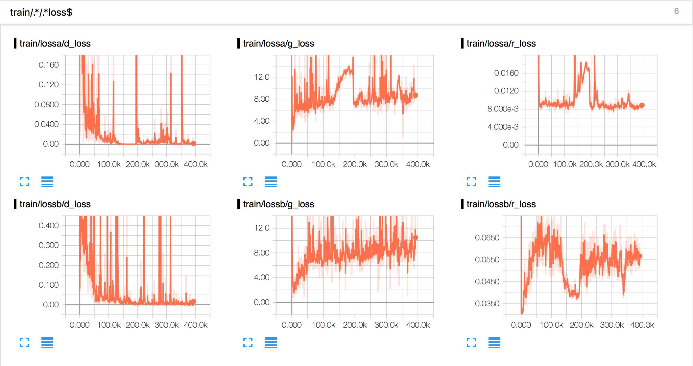

# DiscoGAN implementation in Tensorflow

As part of the implementation series of [Joseph Lim's group at USC](http://csail.mit.edu/~lim), our motivation is to accelerate (or sometimes delay) research in the AI community by promoting open-source projects. To this end, we implement state-of-the-art research papers, and publicly share them with concise reports. Please visit our [group github site](https://github.com/gitlimlab) for other projects.

This project is implemented by [Jiayuan Mao](https://github.com/vacancy) and reviewed by [Shao-hua Sun](https://github.com/shaohua0116).

## Descriptions

This repo is a [Tensorflow](https://www.tensorflow.org/) implementation of DiscoGAN on Pix2Pix datasets: [Learning to Discover Cross-Domain Relations with Generative Adversarial Networks](https://arxiv.org/abs/1703.05192).

This paper introduced an awesome framework for finding one-to-one mapping between two domains in an unsupervised way. 
The high-level idea is the joint training of two GAN model G1 and G2 in parallel (one for A->B and the other one for B->A). 
Besides the adversarial loss, there is also reconstruction loss to ensure the consistency. 
Specifically, we restrict that G2(G1(A)) = A and G1(G2(B)) = B.

## Requirements

- Python 3.5
- [Tensorflow](https://www.tensorflow.org/)
- [Pillow](https://pillow.readthedocs.io/en/4.0.x/)
- [tqdm](https://github.com/tqdm/tqdm)
- [lmdb](https://lmdb.readthedocs.io)
- [zmq](http://pyzmq.readthedocs.io)
- opencv

## Usage

Clone the whole repo with

    $ git clone --recursive https://github.com/gitlimlab/DiscoGAN-Tensorflow

This implementation is based on a third-party neural network library for Tensorflow: TensorArtist.

We have included one TensorArtist version in the repo. For simplicity, first setup your environment by 

	$ source activate.sh

This will export some environment variables. In particular, this allows you to run `tart` command.

Download the dataset with the scripts in `dataset-tools` directory. The detail usage is contained inside the README file inside the directory. After downloading the datasets, you need to move the LMDB generated to data/Pix2Pix directory. For `edges2shoes` dataset, put two lmdbs in `data/Pix2Pix/edges2shoes/` directory.

Download the dataset edges2shoes with the script `dataset-tool/gen-lmdb-pair.py`. And the two downloaded folder into the directory `./data/Pix2Pix/edges2shoes`.

For the training, simply run

    $ tart-train desc_discogan_edges2shoes_cnn.py -d gpu0

After the training procedure, demonstrate your result using

    $ tart-demo desc_discogan_edges2shoes_cnn.py -d gpu0 -e last

## Results on edges2shoes dataset

The left part of the image is edges -> shoes mapping (the odd columns are the edges and even columns are the shoes) the right part, 
while the right part is shoes -> edges mapping.

**The result shown here is not the final result, but results at an early stage (@epoch 30).**

Demonstration of training losses.

## FAQ

Q: How to use multiple gpus or cpu for training?

A: Try the following command `tart-train desc_***.py -d gpu0 gpu1` or `tart-train desc_***.py -d 0 1` or `tart-train desc_***.py -d cpu`.

Q: How can I get the trained model?

A: All training results will be put in your `dump` directory. Inside the `snapshots` directory are the snapshot for models after every epoch. 
The models can be simply loaded with a python `pickle` package. And all weights/biases are stored as `numpy` arrays in the `pickle` file.

Q: How to restore a training?

A: Try `tart-train desc_***.py -d gpu0 --continue` (continue from last snapshot) or `tart-train desc_***.py -d gpu0 --continue-from 10` (continue from the snapshot for the 10th epoch).

Q: How can I use Tensorboard to visualize the training?

A: After the training started, it will automatically open a tensorboard application listening on a random port. You can find the port on the log message.
An alternative way is to open a tensorboard yourself by find the directory named `tensorboard` in your `dump` directory, which is the log directory.

Q: How to demonstrate the result for intermediate epochs?

A: All snapshots can be found in the `dump/***/snapshots` directory. You can run the demo with `tart-demo desc_***.py -d gpu0 -e 10` (the 10th snapshot), or `tart-demo desc_***.py -d gpu0 -w dump/***/snapshots/***.snapshot.pkl` (custom snapshot file).

Q: How to run experients based on your code?

A: Note that when you start a new training using the same description file (`desc_***.py`), it will OVERWRITE your previous training. So the suggested way is to copy the old description file to a new one with different name (so that they will not be dumped into the same directory) and make your modification.
